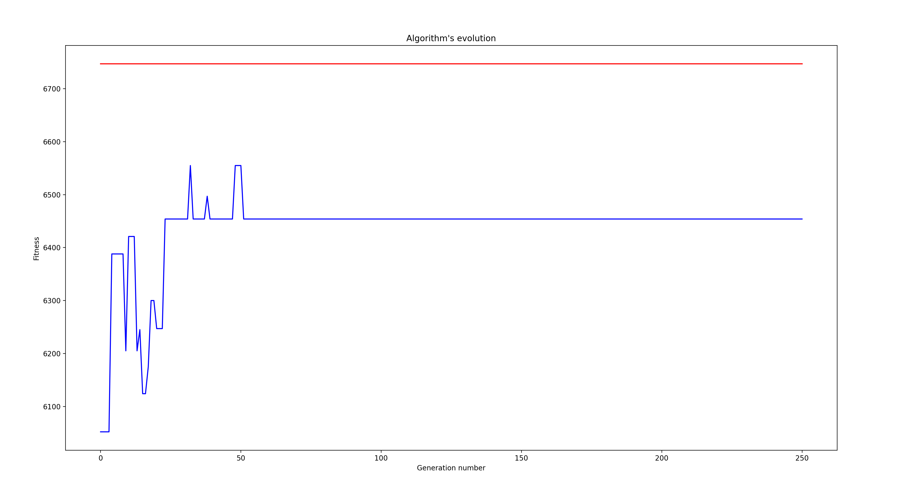
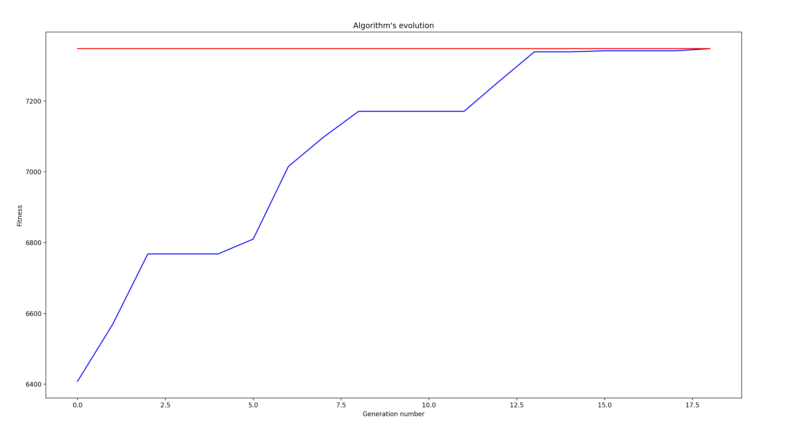
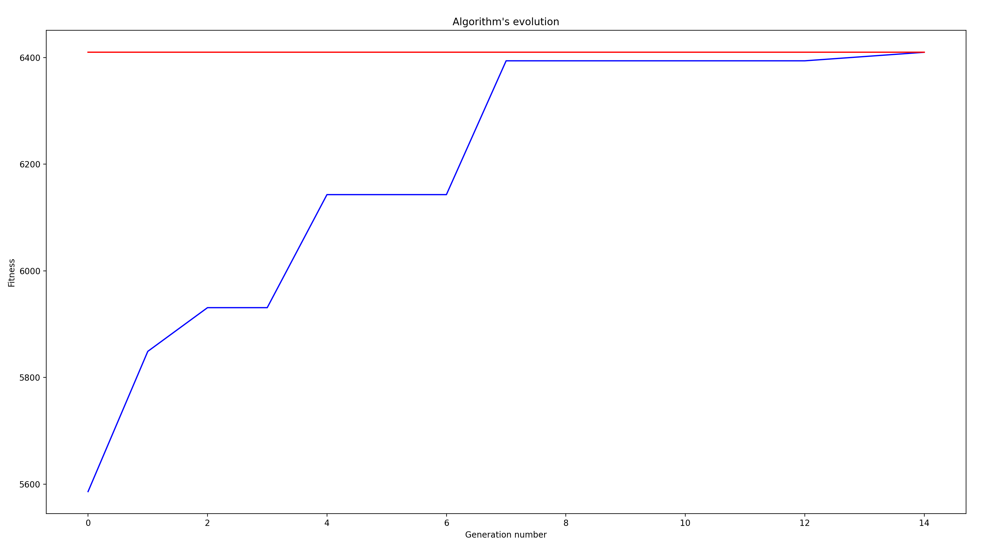
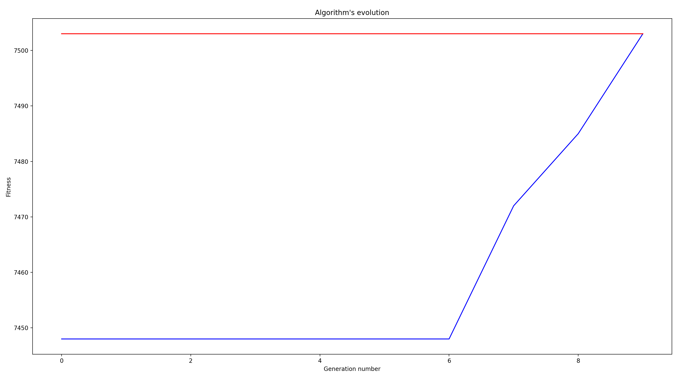
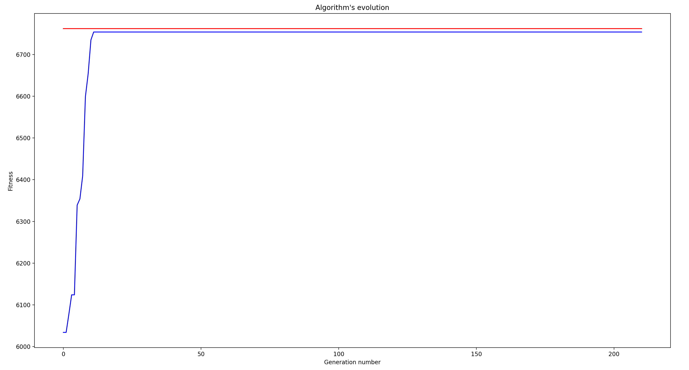

# Algorytm genetyczny do rozwiązania problemu plecakowego – omówienie

### Opis problemu
Celem zadania było napisanie algorytmu genetycznego do rozwiązywania problemu plecakowego.
Polega on na tym, że mając daną ilość przedmiotów o danej wadze przekraczającej pojemność plecaka musimy je dobrać w jak najbardziej optymalny sposób tj. zostawiając jak najmniej wolnego miejsca. Problem ten jest NP-zupełny, co oznacza, że nie istnieje algorytm o złożoności wielomianowej zdolny wyliczyć prawidłowe rozwiązanie.
Jednym ze sposobów zredukowania czasu, przy jednoczesnym założeniu, że wyniki, które otrzymamy będą dostatecznie satysfakcjonujące jest wykorzystanie algorytmu genetycznego.

### Opis rozwiązania
Do implementacji użyłem języka Python w wersji 3.8.

Pojedyńczy genom reprezentowany jest przez tablicę bitów *bitarray* z pakietu *bitarray*, a populacja przez listę genomów

```python
Genome = bitarray
Population = List[Genome]
```

Lista przedmiotów reprezentowana jest jako tablica zawierająca wartości typu *int* generowane przez bibliotekę *numpy*
```python
MIN_WEIGHT_BOUND = 10
MAX_WEIGHT_BOUND = 200
CARRY_FACTOR = 2 / 3 # jaką część maksymalnej wagi pomieści plecak

def generate_items(size: int, min_bound: int, max_bound: int) -> Tuple[List[int], int]:
    max_weight = 0
    generated_items = []

    for i in range(size):
        item = np.random.randint(min_bound, max_bound)
        max_weight += item
        generated_items.append(item)

    return generated_items, int(max_weight * CARRY_FACTOR)
```

Generowanie populacji odbywa się w poniższej metodzie przyjmującej wielkość populacji jak i długość genomu odpowiadającej ilości przedmiotów. Jeśli n-ty bit genomu ustawiony jest na **1** oznacza to, że n-ty przedmiot z listy przedmiotów znajduje się w plecaku i jego wagę powinniśmy doliczyć przy obliczaniu funkcji dopasowania.

```python
POPULATION_SIZE = 20
GENOME_LENGTH = 100

def generate_population(size: int, genome_lenth: int) -> Population:
    return [bitarray(np.random.choice([0, 1]) for _ in range(genome_lenth)) for _ in range(size)]
```

Do przeprowadzenia operacji krzyżowania wykorzystuję funkcję crossover krzyżującą po jednym punkcie.

```python
def crossover(population: Population) -> Population:
    crossed_population = copy(population)

    while len(population) != 0:
        first_parent = population.pop(np.random.randint(0, len(population)))
        second_parent = population.pop(np.random.randint(0, len(population)))

        crossover_point = np.random.randint(0, len(first_parent))

        crossed_population.append(bitarray(first_parent[0:crossover_point] + second_parent[crossover_point:]))
        crossed_population.append(bitarray(second_parent[0:crossover_point] + first_parent[crossover_point:]))

    return crossed_population
```

Następnie na całej populacji wykonywana jest jednopunktowa mutacja. Każdy genom może mieć odwrócony jeden losowy bit z prawdopodobieństwem 50%.

```python
def mutation(population, probability: float = 0.5):
    for genome in population:
        if np.random.rand() >= probability:
            genome.invert(np.random.randint(0, len(genome)))
```

Musimy jeszcze napisać funkcję dopasowania (z *ang. fitness*), aby być w stanie odróżnić lepsze rozwiązania od gorszych.

```python
def fitness(first_pretendent: Genome, items: List[int], carry_limit: int):
    curr_weight = 0

    for i in range(len(first_pretendent)):
        # jesli bit ustawiony jest na 1 dodaj wage przedmiotu
        if first_pretendent[i] == 1:
            curr_weight += items[i]

            # jesli laczna waga przekroczyla limit plecaka
            if curr_weight > carry_limit:
                return 0

    return curr_weight
```

Nadeszła kolej na redukcję naszej populacji. Do tego celu wykonujemy selekcję, która zmniejsza naszą populację o 50%. Zaimplementowałem 4 podstawowe algorytmy selekcji:
* selekcja turniejowa
* selekcja koła ruletki
* selekcja elitystyczna
* selekcja połowy najlepszych

W selekcji turniejowej z listy kandydatów w pętli wybieramy dwóch pretendentów, z których maksymalnie jeden może przetrwać do następnej generacji.

```python
def tournament_selection(candidates: Population, items: List[int], carry_limit: int) -> Population:
    next_gen_population = []

    # w pętli wybieramy dwa losowe genomy, które zawalczą o przejście do kolejnej generacji
    while len(candidates) != 0:
        first_pretendent = candidates.pop(np.random.randint(0, len(candidates)))
        second_pretendent = candidates.pop(np.random.randint(0, len(candidates)))

        fitness_first = fitness(first_pretendent, items, carry_limit)
        fitness_second = fitness(second_pretendent, items, carry_limit)

        if fitness_first > fitness_second:
            next_gen_population.append(first_pretendent)
        elif fitness_first < fitness_second:
            next_gen_population.append(second_pretendent)
        else:
            if fitness_first != 0:
                next_gen_population.append(first_pretendent)
            else:
                # jesli oba genomy nie były dopasowane (przekroczyły limit plecaka) wygeneruj nowy
                next_gen_population.append(bitarray(np.random.choice([0, 1]) for _ in range(GENOME_LENGTH)))
    return next_gen_population
```

W selekcji koła ruletki korzystamy z funkcji *choices* pakietu *random*, która posiada możliwość dodania wag genomom. Wagami będzie funkcja dopasowania.
```python
def roulette_selection(candidates: Population, items: List[int], carry_limit: int) -> Population:
    fitnesses = [fitness(pretendent, items, carry_limit) for pretendent in candidates]

    return random.choices(candidates, weights=fitnesses, k=int(len(candidates) / 2))
```

W selekcji elitystycznej wybieramy jakąś część najlepiej dostosowanych osobników a dla pozostałej części dokonujemy selekcji. Dzięki temu nie tracimy najlepszych rozwiązań przy przejściu do kolejnej generacji.
```python
ELITISM_SELECTION_PERCENTAGE = int(POPULATION_SIZE * 0.2)  # 20% najlepszych przechodzi bez zmian do następnej generacji

def elitism_selection(candidates: Population, items: List[int], carry_limit: int) -> Population:
    next_gen_population = []
    sorted_candidates = sorted(candidates, key=lambda genome: fitness(genome, items, carry_limit), reverse=True)

    # dodajemy najlepszych
    next_gen_population.extend(sorted_candidates[0:ELITISM_SELECTION_PERCENTAGE])

    # pozostałych możemy wybrać losowo lub zastosować którąś z pozostałych metod selekcji 
    next_gen_population.extend(roulette_selection(candidates[ELITISM_SELECTION_PERCENTAGE:], items, carry_limit))

    return next_gen_population
```

Selekcja połowy najlepszych polega na posortowaniu populacji od najlepiej dopasowanego osobnika i wybraniu połowy.
```python
def get_best_selection(candidates: Population, items: List[int], carry_limit: int) -> Population:
    return sorted(candidates, key=lambda genome: fitness(genome, items, carry_limit), reverse=True)[
           :int(len(candidates) / 2)]
```

Do naszej pętli przyda się nam jeszcze funkcja sprawdzająca, czy przez N ostatnich generacji mieliśmy jakieś usprawnienie.
```python
def is_not_improving(best_fitness_per_generation: List[int]) -> bool:
    if len(best_fitness_per_generation) < FITNESS_CHANGE_BOUND:
        return False

    last_element = best_fitness_per_generation[-1]

    # iterujemy listę od końca i sprawdzamy czy wartości się zmieniają
    for element in best_fitness_per_generation[-FITNESS_CHANGE_BOUND:]:
        if last_element != element:
            return False
    return True
```

Mając arsenał powyżej zdefiniowanych funkcji możemy napisać główną pętle programu.
```python
FITNESS_CHANGE_BOUND = 200
MAX_GENERATIONS = 1000

if __name__ == '__main__':
    # generujemy populacje i przedmioty
    population = generate_population(POPULATION_SIZE, GENOME_LENGTH)
    items, carry_limit = generate_items(GENOME_LENGTH, MIN_WEIGHT_BOUND, MAX_WEIGHT_BOUND)

    generation = 0
    best_fitness_per_generation = []

    # zaczynamy pętle ewolucji
    for generation_num in range(MAX_GENERATIONS):
        generation += 1

        # najpierw wykonujemy krzyżowanie
        next_generation_candidates = crossover(population)

        # następnie mutacja
        mutation(population)

        # na końcu selekcja (tylko jedna z poniższych linii powinna być odkomentowana jednocześnie)
        population = tournament_selection(next_generation_candidates, items, carry_limit)
        # population = roulette_selection(next_generation_candidates, items, carry_limit)
        # population = elitism_selection(next_generation_candidates, items, carry_limit)
        # population = get_best_selection(next_generation_candidates, items, carry_limit)

        # sortujemy, żeby sprawdzić, czy znaleźliśmy rozwiązanie lub poddajemy się bo nie widać zmian przez wiele generacji
        population = sorted(population, key=lambda genome: fitness(genome, items, carry_limit), reverse=True)

        current_best_fitness = fitness(population[0], items, carry_limit)
        best_fitness_per_generation.append(current_best_fitness)
        
        # jesli obecne najlepsze rozwiązanie wypełnia cały plecak
        if current_best_fitness == carry_limit:
            break

        # sprawdzamy, czy przez ostatnie x iteracji była jakakolwiek poprawa
        if is_not_improving(best_fitness_per_generation):
            print('Best fitnesses has not changed since {} generations'.format(FITNESS_CHANGE_BOUND))
            break

    # finalny wynik
    population = sorted(population, key=lambda genome: fitness(genome, items, carry_limit), reverse=True)

    # podsumowanie
    print('Finished in {} generations'.format(generation))
    print('Carry limit: ', carry_limit)
    print('Best solution: ', fitness(population[0], items, carry_limit))
```

### Podsumowanie
Wyniki pokazują, że selekcja koła ruletki niekoniecznie nadaje się dobrze do rozwiązania tego typu problemu. Wartości zwłaszcza na początku mogą być zbliżone, przez co szansa na wylosowanie gorszego z rozwiązań jest niewiele mniejsza niż ta na wylosowanie lepszego.
Dodatkowo losowość może sprawić, że zgubimy lepsze rozwiązanie po drodze, co zwłaszcza widać na poniższym screenie
 

Przed utratą najlepszych rozwiązań zabezpiecza nas natomiast selekcja elitystyczna. Zawsze zapisujemy w niej kilka najlepiej przystosowanych genomów. Poniżej screen z przykładowej zbieżności.


W selekcji turniejowej mierzą się dwa losowe genomy i lepiej przystowany z nich przechodzi do następnej generacji. Jest to pewna zaleta, bo szybko eliminujemy najgorsze rozwiązania.
Metoda ta ma jednak wadę. Gdy przykładowo w jednym turnieju mierzą się dwa najbardziej przystosowe genomy jeden z nich musi odpaść, przez co tracimy dobre rozwiązanie z potencjałem na lepsze krzyżowanie.
Z drugiej strony w turnieju mogą się mierzyć dwa najgorzej przystosowane genomy i po walce zostajemy z lepszym genomem, jednak nadal stosunkowo kiepskim w porównaniu do pozostałych.


Teoretycznie najlepszym rozwiązaniem w tym przypadku jest posortowanie populacji od najbardziej przystosowanego i wybranie pierwszej połowy. Musimy jednak pamiętać, że
dla dużej populacji sortowanie może również zająć dużo czasu. 


Innym wnioskiem jest, że dobranie algorytmu jak i jego zbieżność mocno zależy od dobranych parametrów wielkości plecaka, ilości przedmiotów i wielkości populacji.
Bardzo częstym przypadkiem było to, że algorytm znajdował rozwiązanie potencjalnie najlepsze ale jednak nie idealne (które może nie istnieć), dlatego dobrą praktyką jest dodawanie warunków stopu.
